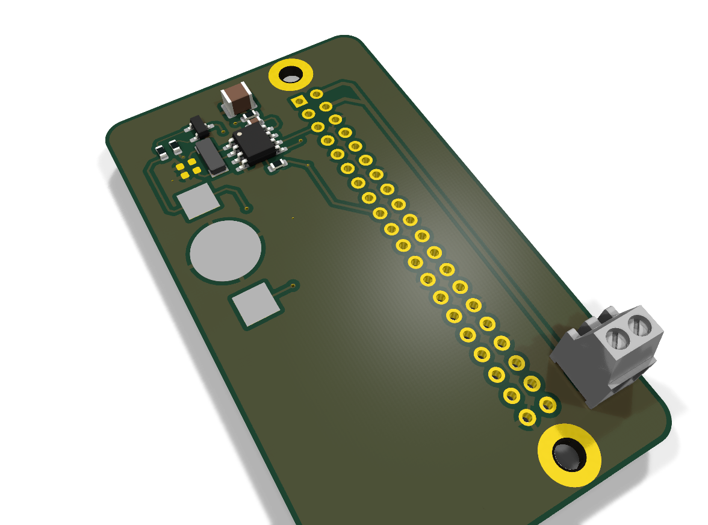

# PI-HAT Power Control

**Raspberry Pi HAT with Real-Time Clock and Power Management**

<p align="center">
  
</p>

---

## 📋 Overview

This KiCad project provides a Raspberry Pi HAT featuring:
- **M41T0M6F** Serial Real-Time Clock with battery backup
- **32.768 kHz** crystal oscillator for precise timekeeping
- Power control and management circuitry
- Standard Raspberry Pi 40-pin GPIO header compatibility

**Company:** NortekMed  
**Version:** v300326 (2026-03-30)  
**Design Tool:** KiCad 10.0

---

## 📂 Project Structure

```
PI-HAT_POWER_CON/
├── DOCUMENTATION/
│   └── datasheet/           # Component datasheets (11 components)
├── FABRICATION/
│   ├── GERBER_v300326.zip   # Manufacturing files (Gerber + drill)
│   └── PI-HAT_POWER_CON_3D_v300326.png
├── GERBER/                  # Individual Gerber layer files
├── MECHANICAL/              # Mechanical drawings and models
├── SCHEMATICS/              # Additional schematic resources
├── PI-HAT_POWER_CON.kicad_pcb    # PCB layout file
├── PI-HAT_POWER_CON.kicad_sch    # Schematic file
├── PI-HAT_POWER_CON.kicad_pro    # KiCad project file
└── NortekLogo.png
```

---

## 🔧 Key Components

| Component | Part Number | Description |
|-----------|-------------|-------------|
| **RTC** | M41T0M6F | STMicroelectronics Serial RTC |
| **Oscillator** | CC4V-T1A | 32.768 kHz crystal oscillator |
| **Diode** | BAT54C-7-F | Schottky diode array |
| **Battery Holder** | Keystone 3000 | CR1220 coin cell holder |
| **Connector** | 282834-2 | Terminal block |

---

## 📁 Manufacturing Files

**Production-ready Gerber files:**
- `FABRICATION/GERBER_v300326.zip` - Complete manufacturing package
  - Gerber layers (top, bottom, silkscreen, solder mask)
  - Drill files (PTH and NPTH)
  - Job report

**Component Documentation:**
- All datasheets available in `DOCUMENTATION/datasheet/`
- Bill of Materials with Farnell part numbers in schematic

---

## 🛠️ Technical Specifications

- **Board Type:** 2-layer PCB
- **Dimensions:** Standard Raspberry Pi HAT form factor
- **Mounting:** Compatible with Raspberry Pi mounting holes
- **Interface:** I2C for RTC communication
- **Power:** Operates from Raspberry Pi 3.3V/5V supply
- **Battery Backup:** CR1220 coin cell for RTC during power-off

---

## 🔋 Maintenance

### RTC Battery Replacement

The Real-Time Clock (M41T0M6F) requires a **CR1220 or CR1225 coin cell battery** to maintain accurate timekeeping when the Raspberry Pi is powered off.

**Battery Specifications:**
- **Type:** CR1220 or CR1225 Lithium coin cell (3V)
- **Holder:** Keystone 3000
- **Typical Lifespan:** 5-10 years (depending on usage)
- **Standby Current:** ~0.9 µA

**Replacement Procedure:**
1. Power off the Raspberry Pi and disconnect all cables
2. Gently press and release the battery from the Keystone 3000 holder
3. Insert new CR1220 or CR1225 battery with positive (+) side facing up
4. Verify battery orientation matches the polarity markings on the PCB
5. Reconnect and power on - box should be start with modem to update/set date

**⚠️ Important Notes:**
- Always use fresh, high-quality CR1220 or CR1225 batteries
- Do not force the battery into the holder
- Dispose of used batteries according to local regulations
- Battery backup only maintains RTC time; it does not power other circuits

---

## 📜 License

© 2026 NortekMed. All rights reserved.
